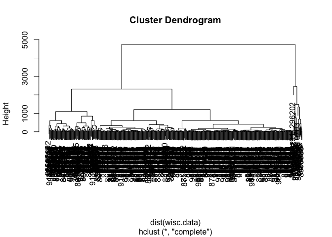

Class 10
================
Varsha Rajesh
2/6/2020

## Analysis of Human Breast Cancer Cells

Import the input data (csv
file).

``` r
wisc.df <- read.csv("https://bioboot.github.io/bimm143_W18/class-material/WisconsinCancer.csv")
wisc.data <- as.matrix(wisc.df[, 3:32])
row.names(wisc.data) <- wisc.df$id
diagnosis <- as.numeric(wisc.df$diagnosis)
diagnosis
```

    ##   [1] 2 2 2 2 2 2 2 2 2 2 2 2 2 2 2 2 2 2 2 1 1 1 2 2 2 2 2 2 2 2 2 2 2 2 2 2 2
    ##  [38] 1 2 2 2 2 2 2 2 2 1 2 1 1 1 1 1 2 2 1 2 2 1 1 1 1 2 1 2 2 1 1 1 1 2 1 2 2
    ##  [75] 1 2 1 2 2 1 1 1 2 2 1 2 2 2 1 1 1 2 1 1 2 2 1 1 1 2 2 1 1 1 1 2 1 1 2 1 1
    ## [112] 1 1 1 1 1 1 2 2 2 1 2 2 1 1 1 2 2 1 2 1 2 2 1 2 2 1 1 2 1 1 2 1 1 1 1 2 1
    ## [149] 1 1 1 1 1 1 1 1 2 1 1 1 1 2 2 1 2 1 1 2 2 1 1 2 2 1 1 1 1 2 1 1 2 2 2 1 2
    ## [186] 1 2 1 1 1 2 1 1 2 2 1 2 2 2 2 1 2 2 2 1 2 1 2 1 1 2 1 2 2 2 2 1 1 2 2 1 1
    ## [223] 1 2 1 1 1 1 1 2 2 1 1 2 1 1 2 2 1 2 1 1 1 1 2 1 1 1 1 1 2 1 2 2 2 2 2 2 2
    ## [260] 2 2 2 2 2 2 2 1 1 1 1 1 1 2 1 2 1 1 2 1 1 2 1 2 2 1 1 1 1 1 1 1 1 1 1 1 1
    ## [297] 1 2 1 1 2 1 2 1 1 1 1 1 1 1 1 1 1 1 1 1 1 2 1 1 1 2 1 2 1 1 1 1 2 2 2 1 1
    ## [334] 1 1 2 1 2 1 2 1 1 1 2 1 1 1 1 1 1 1 2 2 2 1 1 1 1 1 1 1 1 1 1 1 2 2 1 2 2
    ## [371] 2 1 2 2 1 1 1 1 1 2 1 1 1 1 1 2 1 1 1 2 1 1 2 2 1 1 1 1 1 1 2 1 1 1 1 1 1
    ## [408] 1 2 1 1 1 1 1 2 1 1 2 1 1 1 1 1 1 1 1 1 1 1 1 2 1 2 2 1 2 1 1 1 1 1 2 1 1
    ## [445] 2 1 2 1 1 2 1 2 1 1 1 1 1 1 1 1 2 2 1 1 1 1 1 1 2 1 1 1 1 1 1 1 1 1 1 2 1
    ## [482] 1 1 1 1 1 1 2 1 2 1 1 2 1 1 1 1 1 2 2 1 2 1 2 1 1 1 1 1 2 1 1 2 1 2 1 2 2
    ## [519] 1 1 1 2 1 1 1 1 1 1 1 1 1 1 1 2 1 2 2 1 1 1 1 1 1 1 1 1 1 1 1 1 1 1 1 1 1
    ## [556] 1 1 1 1 1 1 1 2 2 2 2 2 2 1

``` r
#Here, we imported the data set into a data frame, then made a new matrix where we got rid of the ID and diagnosis variables, and deleted the last coloumn (a mistake in the original data sheet).
```

> Q1. How many patients do we have data for?

``` r
nrow(wisc.data)
```

    ## [1] 569

> Q2. How many of the observations have a malignant diagnosis?

``` r
table(wisc.df$diagnosis)
```

    ## 
    ##   B   M 
    ## 357 212

> Q3. How many variables/features in the data are fixed with \_mean?

``` r
length(grep("_mean", colnames(wisc.data), value = TRUE))
```

    ## [1] 10

## Principal Component Analysis of imported data

We need to scale the data before we do PCA. Two common reasons for
scaling data include:

The input variables use different units of measurement. The input
variables have significantly different
    variances.

``` r
round(apply(wisc.df, 2, sd), 2)
```

    ## Warning in var(if (is.vector(x) || is.factor(x)) x else as.double(x), na.rm =
    ## na.rm): NAs introduced by coercion

    ##                      id               diagnosis             radius_mean 
    ##            125020585.61                      NA                    3.52 
    ##            texture_mean          perimeter_mean               area_mean 
    ##                    4.30                   24.30                  351.91 
    ##         smoothness_mean        compactness_mean          concavity_mean 
    ##                    0.01                    0.05                    0.08 
    ##     concave.points_mean           symmetry_mean  fractal_dimension_mean 
    ##                    0.04                    0.03                    0.01 
    ##               radius_se              texture_se            perimeter_se 
    ##                    0.28                    0.55                    2.02 
    ##                 area_se           smoothness_se          compactness_se 
    ##                   45.49                    0.00                    0.02 
    ##            concavity_se       concave.points_se             symmetry_se 
    ##                    0.03                    0.01                    0.01 
    ##    fractal_dimension_se            radius_worst           texture_worst 
    ##                    0.00                    4.83                    6.15 
    ##         perimeter_worst              area_worst        smoothness_worst 
    ##                   33.60                  569.36                    0.02 
    ##       compactness_worst         concavity_worst    concave.points_worst 
    ##                    0.16                    0.21                    0.07 
    ##          symmetry_worst fractal_dimension_worst                       X 
    ##                    0.06                    0.02                      NA

We need to set scale = TRUE.

``` r
wisc.pr <- prcomp(wisc.data, scale = TRUE)
summary(wisc.pr)
```

    ## Importance of components:
    ##                           PC1    PC2     PC3     PC4     PC5     PC6     PC7
    ## Standard deviation     3.6444 2.3857 1.67867 1.40735 1.28403 1.09880 0.82172
    ## Proportion of Variance 0.4427 0.1897 0.09393 0.06602 0.05496 0.04025 0.02251
    ## Cumulative Proportion  0.4427 0.6324 0.72636 0.79239 0.84734 0.88759 0.91010
    ##                            PC8    PC9    PC10   PC11    PC12    PC13    PC14
    ## Standard deviation     0.69037 0.6457 0.59219 0.5421 0.51104 0.49128 0.39624
    ## Proportion of Variance 0.01589 0.0139 0.01169 0.0098 0.00871 0.00805 0.00523
    ## Cumulative Proportion  0.92598 0.9399 0.95157 0.9614 0.97007 0.97812 0.98335
    ##                           PC15    PC16    PC17    PC18    PC19    PC20   PC21
    ## Standard deviation     0.30681 0.28260 0.24372 0.22939 0.22244 0.17652 0.1731
    ## Proportion of Variance 0.00314 0.00266 0.00198 0.00175 0.00165 0.00104 0.0010
    ## Cumulative Proportion  0.98649 0.98915 0.99113 0.99288 0.99453 0.99557 0.9966
    ##                           PC22    PC23   PC24    PC25    PC26    PC27    PC28
    ## Standard deviation     0.16565 0.15602 0.1344 0.12442 0.09043 0.08307 0.03987
    ## Proportion of Variance 0.00091 0.00081 0.0006 0.00052 0.00027 0.00023 0.00005
    ## Cumulative Proportion  0.99749 0.99830 0.9989 0.99942 0.99969 0.99992 0.99997
    ##                           PC29    PC30
    ## Standard deviation     0.02736 0.01153
    ## Proportion of Variance 0.00002 0.00000
    ## Cumulative Proportion  1.00000 1.00000

> Q4. From your results, what proportion of the original variance is
> captured by the first principal components (PC1)?

PC1 captures 44.27% of the original variance.

> Q2. How many principal components (PCs) are required to describe at
> least 70% of the original variance in the data?

The first three PCs capture about 73% of the variance together.

> Q6. How many principal components (PCs) are required to describe at
> least 90% of the original variance in the data?

Interpreting PCA Results

``` r
biplot(wisc.pr)
```

<!-- -->

This plot is very bad, let’s make another one.

``` r
attributes(wisc.pr)
```

    ## $names
    ## [1] "sdev"     "rotation" "center"   "scale"    "x"       
    ## 
    ## $class
    ## [1] "prcomp"

``` r
plot(wisc.pr$x[,1], wisc.pr$x[,2])
```

<!-- -->

``` r
plot(wisc.pr$x[,1], wisc.pr$x[,2], col = wisc.df$diagnosis, xlab = "PC1", ylab = "PC2")
```

<!-- --> The plot
shows that all the benign cells tend to be more like each other (cluster
closer together on the PCA plot), whereas malignant cells are also close
together somewhat but also have differences from each other, considering
they are somewhat spread apart as compared to the benign cells.

## Cluster in PC Space

Cluster the original data:

``` r
wisc.hclust <- hclust(dist(wisc.data))
plot(wisc.hclust)
```

<!-- --> This
dendrogram doesn’t really give us any valuable information, because its
so hard to read. So we will combine results of PCA with clustering

``` r
wisc.pr.hclust <- hclust(dist(wisc.pr$x[,1:3]), method = "ward.D2")
plot(wisc.pr.hclust)
```

<!-- -->

``` r
grps3 <- cutree(wisc.pr.hclust, k=2)
table(grps3)
```

    ## grps3
    ##   1   2 
    ## 203 366

``` r
plot(wisc.pr$x[,1], wisc.pr$x[,2], col=grps3)
```

<!-- -->

Use table() function to compare the $diagnosis vector with our cluster
results vector.

``` r
table(grps3, wisc.df$diagnosis)
```

    ##      
    ## grps3   B   M
    ##     1  24 179
    ##     2 333  33

In this table, we are basically taking the two clusters and seeing how
many in each cluster are actually B or M according to the given data
set. In cluster 1, it seems to be more representative of the malignant
cells, so we have 179 true positives and 24 false positives. For the
second cluster, it seems that most are benign, so 333 are true
positives, and 33 are false positives.

## Prediction

Read the new samples, and use predict function with the previous PCA
model and the new data to predict.

``` r
new <- read.csv("new_samples.csv")
new
```

    ##   radius_mean texture_mean perimeter_mean area_mean smoothness_mean
    ## 1       8.598        20.98          54.66     221.8          0.1243
    ## 2      14.250        22.15          96.42     645.7          0.1049
    ##   compactness_mean concavity_mean concave.points_mean symmetry_mean
    ## 1          0.08963         0.0300            0.009259        0.1828
    ## 2          0.20080         0.2135            0.086530        0.1949
    ##   fractal_dimension_mean radius_se texture_se perimeter_se area_se
    ## 1                0.06757    0.3582      2.067        2.493   18.39
    ## 2                0.07292    0.7036      1.268        5.373   60.78
    ##   smoothness_se compactness_se concavity_se concave.points_se symmetry_se
    ## 1      0.011930        0.03162      0.03000          0.009259     0.03357
    ## 2      0.009407        0.07056      0.06899          0.018480     0.01700
    ##   fractal_dimension_se radius_worst texture_worst perimeter_worst area_worst
    ## 1             0.003048        9.565         27.04           62.06      273.9
    ## 2             0.006113       17.670         29.51          119.10      959.5
    ##   smoothness_worst compactness_worst concavity_worst concave.points_worst
    ## 1           0.1639            0.1698         0.09001              0.02778
    ## 2           0.1640            0.6247         0.69220              0.17850
    ##   symmetry_worst fractal_dimension_worst
    ## 1         0.2972                 0.07712
    ## 2         0.2844                 0.11320

``` r
npc <- predict(wisc.pr, newdata = new)
npc
```

    ##            PC1       PC2        PC3        PC4       PC5        PC6        PC7
    ## [1,]  2.576616 -3.135913  1.3990492 -0.7631950  2.781648 -0.8150185 -0.3959098
    ## [2,] -4.754928 -3.009033 -0.1660946 -0.6052952 -1.140698 -1.2189945  0.8193031
    ##             PC8       PC9       PC10      PC11      PC12      PC13     PC14
    ## [1,] -0.2307350 0.1029569 -0.9272861 0.3411457  0.375921 0.1610764 1.187882
    ## [2,] -0.3307423 0.5281896 -0.4855301 0.7173233 -1.185917 0.5893856 0.303029
    ##           PC15       PC16        PC17        PC18        PC19       PC20
    ## [1,] 0.3216974 -0.1743616 -0.07875393 -0.11207028 -0.08802955 -0.2495216
    ## [2,] 0.1299153  0.1448061 -0.40509706  0.06565549  0.25591230 -0.4289500
    ##            PC21       PC22       PC23       PC24        PC25         PC26
    ## [1,]  0.1228233 0.09358453 0.08347651  0.1223396  0.02124121  0.078884581
    ## [2,] -0.1224776 0.01732146 0.06316631 -0.2338618 -0.20755948 -0.009833238
    ##              PC27        PC28         PC29         PC30
    ## [1,]  0.220199544 -0.02946023 -0.015620933  0.005269029
    ## [2,] -0.001134152  0.09638361  0.002795349 -0.019015820

Draw the PCA plot again and add our new data:

``` r
plot(wisc.pr$x[,1], wisc.pr$x[,2], col = wisc.df$diagnosis)
points(npc[,1], npc[,2], col = "blue", pch = 15, cex =2)
text(npc[,1], npc[,2], labels = c(1,2), col = "white")
```

<!-- -->
