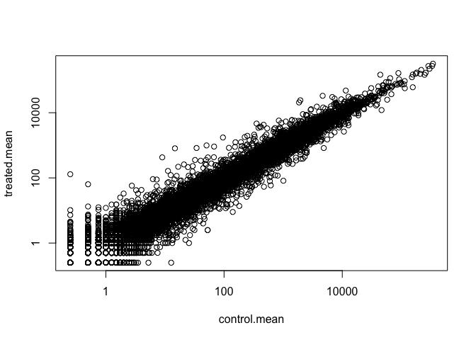
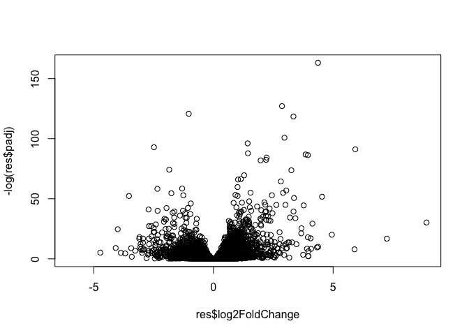
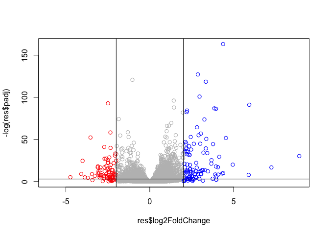

Class 15
================

## Transcriptomics and analysis of RNA-Seq Data

# 1: Bioconductor and DESeq2 Setup

Installed BiocManager and DESeq2

# 2: Import countData and colData

``` r
counts <- read.csv("airway_scaledcounts.csv", stringsAsFactors = FALSE)
metadata <- read.csv("airway_metadata.csv", stringsAsFactors = FALSE)
```

How many genes are we looking at?

``` r
nrow(counts)
```

    ## [1] 38694

# 3: Toy differential gene expression

We want to calculate the average counts per gene for control samples and
for the drug treated samples, and then compare those average to see if
there are significant
differences.

``` r
#This gives the IDs that are the control samples in metadata, and stores it in a new data frame with all the attached information for each ID from metadata.
control <- metadata[metadata$dex == "control",]
```

``` r
#Now we use $id of the control data frame to access the control columns in counts and calculate the average. 
control.mean <- rowSums(counts[ ,control$id]) / nrow(control)
names(control.mean) <- counts$ensgene
```

Now we do the same for treated.

``` r
treated <- metadata[metadata$dex == "treated",]
treated.mean <- rowSums(counts[ ,treated$id]) / nrow(treated)
names(treated.mean) <- counts$ensgene
```

Now we create a new data frame where we combine these averages together.

``` r
meancounts <- data.frame(control.mean, treated.mean)
```

Now we plot control averages vs treated averages. If we see a straight
line, it tells us that the drug has little to no
    effect.

``` r
plot(meancounts, log = "xy")
```

    ## Warning in xy.coords(x, y, xlabel, ylabel, log): 15032 x values <= 0 omitted
    ## from logarithmic plot

    ## Warning in xy.coords(x, y, xlabel, ylabel, log): 15281 y values <= 0 omitted
    ## from logarithmic plot

<!-- -->

We can then single out genes that have a large change between control
and treated samples. We can see the log2 of the fold
change.

``` r
meancounts$log2fc <- log2(meancounts[,"treated.mean"]/meancounts[,"control.mean"])
head(meancounts)
```

    ##                 control.mean treated.mean      log2fc
    ## ENSG00000000003       900.75       658.00 -0.45303916
    ## ENSG00000000005         0.00         0.00         NaN
    ## ENSG00000000419       520.50       546.00  0.06900279
    ## ENSG00000000457       339.75       316.50 -0.10226805
    ## ENSG00000000460        97.25        78.75 -0.30441833
    ## ENSG00000000938         0.75         0.00        -Inf

There are weird results: Inf and NaN. We have to remove these from the
data set. We are just interested in the genes that have 0
values.

``` r
#We look at meancounts, and see which columns  (treated and control means) for each row have values of zero. 
zero.vals <- which(meancounts[,1:2]==0, arr.ind=TRUE)
#here, we store the unique genes (we don't want repeats) in a new variable called to.rm, and then we make a new data.frame called mycounts where we subtract those values stored in to.rm.
to.rm <- unique(zero.vals[,1])
mycounts <- meancounts[-to.rm,]
head(mycounts)
```

    ##                 control.mean treated.mean      log2fc
    ## ENSG00000000003       900.75       658.00 -0.45303916
    ## ENSG00000000419       520.50       546.00  0.06900279
    ## ENSG00000000457       339.75       316.50 -0.10226805
    ## ENSG00000000460        97.25        78.75 -0.30441833
    ## ENSG00000000971      5219.00      6687.50  0.35769358
    ## ENSG00000001036      2327.00      1785.75 -0.38194109

``` r
#how many genes do we have left?
nrow(mycounts)
```

    ## [1] 21817

A common threshold used for calling something differentially expressed
is a log2 foldchange of greater than 2 or less than -2. Let’s filter the
dataset both ways to see how many genes are up or
down-regulated.

``` r
#We store the values that have a fold change greater than 2 in up.ind, and the values that have a fold change less than -2 in down.ind. 
up.ind <- mycounts$log2fc > 2
down.ind <- mycounts$log2fc < (-2)
```

# 4: Adding annotation data

# 5: DESeq2 Analysis

Set up input for DESeq by specifying countdata, metadata, and the
experiment design (the comparisons we are interested in).

``` r
library(DESeq2)
```

    ## Loading required package: S4Vectors

    ## Loading required package: stats4

    ## Loading required package: BiocGenerics

    ## Loading required package: parallel

    ## 
    ## Attaching package: 'BiocGenerics'

    ## The following objects are masked from 'package:parallel':
    ## 
    ##     clusterApply, clusterApplyLB, clusterCall, clusterEvalQ,
    ##     clusterExport, clusterMap, parApply, parCapply, parLapply,
    ##     parLapplyLB, parRapply, parSapply, parSapplyLB

    ## The following objects are masked from 'package:stats':
    ## 
    ##     IQR, mad, sd, var, xtabs

    ## The following objects are masked from 'package:base':
    ## 
    ##     anyDuplicated, append, as.data.frame, basename, cbind, colnames,
    ##     dirname, do.call, duplicated, eval, evalq, Filter, Find, get, grep,
    ##     grepl, intersect, is.unsorted, lapply, Map, mapply, match, mget,
    ##     order, paste, pmax, pmax.int, pmin, pmin.int, Position, rank,
    ##     rbind, Reduce, rownames, sapply, setdiff, sort, table, tapply,
    ##     union, unique, unsplit, which, which.max, which.min

    ## 
    ## Attaching package: 'S4Vectors'

    ## The following object is masked from 'package:base':
    ## 
    ##     expand.grid

    ## Loading required package: IRanges

    ## Loading required package: GenomicRanges

    ## Loading required package: GenomeInfoDb

    ## Loading required package: SummarizedExperiment

    ## Loading required package: Biobase

    ## Welcome to Bioconductor
    ## 
    ##     Vignettes contain introductory material; view with
    ##     'browseVignettes()'. To cite Bioconductor, see
    ##     'citation("Biobase")', and for packages 'citation("pkgname")'.

    ## Loading required package: DelayedArray

    ## Loading required package: matrixStats

    ## 
    ## Attaching package: 'matrixStats'

    ## The following objects are masked from 'package:Biobase':
    ## 
    ##     anyMissing, rowMedians

    ## Loading required package: BiocParallel

    ## 
    ## Attaching package: 'DelayedArray'

    ## The following objects are masked from 'package:matrixStats':
    ## 
    ##     colMaxs, colMins, colRanges, rowMaxs, rowMins, rowRanges

    ## The following objects are masked from 'package:base':
    ## 
    ##     aperm, apply, rowsum

``` r
dds <- DESeqDataSetFromMatrix(countData=counts, 
                              colData=metadata, 
                              design=~dex, 
                              tidy=TRUE)
```

    ## converting counts to integer mode

    ## Warning in DESeqDataSet(se, design = design, ignoreRank): some variables in
    ## design formula are characters, converting to factors

``` r
dds
```

    ## class: DESeqDataSet 
    ## dim: 38694 8 
    ## metadata(1): version
    ## assays(1): counts
    ## rownames(38694): ENSG00000000003 ENSG00000000005 ... ENSG00000283120
    ##   ENSG00000283123
    ## rowData names(0):
    ## colnames(8): SRR1039508 SRR1039509 ... SRR1039520 SRR1039521
    ## colData names(4): id dex celltype geo_id

``` r
dds <- DESeq(dds)
```

    ## estimating size factors

    ## estimating dispersions

    ## gene-wise dispersion estimates

    ## mean-dispersion relationship

    ## final dispersion estimates

    ## fitting model and testing

``` r
res <- results(dds)
res
```

    ## log2 fold change (MLE): dex treated vs control 
    ## Wald test p-value: dex treated vs control 
    ## DataFrame with 38694 rows and 6 columns
    ##                          baseMean     log2FoldChange             lfcSE
    ##                         <numeric>          <numeric>         <numeric>
    ## ENSG00000000003  747.194195359907 -0.350703020686579 0.168245681332529
    ## ENSG00000000005                 0                 NA                NA
    ## ENSG00000000419  520.134160051965  0.206107766417861 0.101059218008052
    ## ENSG00000000457  322.664843927049 0.0245269479387471 0.145145067649248
    ## ENSG00000000460   87.682625164828  -0.14714204922212 0.257007253994673
    ## ...                           ...                ...               ...
    ## ENSG00000283115                 0                 NA                NA
    ## ENSG00000283116                 0                 NA                NA
    ## ENSG00000283119                 0                 NA                NA
    ## ENSG00000283120 0.974916032393564  -0.66825846051647  1.69456285241871
    ## ENSG00000283123                 0                 NA                NA
    ##                               stat             pvalue              padj
    ##                          <numeric>          <numeric>         <numeric>
    ## ENSG00000000003   -2.0844696749953 0.0371174658432827 0.163034808641681
    ## ENSG00000000005                 NA                 NA                NA
    ## ENSG00000000419    2.0394751758463 0.0414026263001167 0.176031664879168
    ## ENSG00000000457  0.168982303952746  0.865810560623561 0.961694238404388
    ## ENSG00000000460  -0.57252099672319  0.566969065257939 0.815848587637724
    ## ...                            ...                ...               ...
    ## ENSG00000283115                 NA                 NA                NA
    ## ENSG00000283116                 NA                 NA                NA
    ## ENSG00000283119                 NA                 NA                NA
    ## ENSG00000283120 -0.394354484734893  0.693319342566817                NA
    ## ENSG00000283123                 NA                 NA                NA

Padj is the adjusted p-value (we have to make it more stringent in order
because we have so many genes to worry about - if the p-value threshold
were 0.05, we would have a ton of false-positives). We then plot the
fold change vs the padj. We take the log of padj in order to get a
linear trend that is easier to visualize. We take the negative so that
it isn’t upside down.

``` r
plot(res$log2FoldChange, -log(res$padj))
```

<!-- -->

``` r
mycols <- rep("gray", nrow(res))
mycols[res$log2FoldChange > 2] <- "blue"
mycols[res$log2FoldChange < -2] <- "red"
plot(res$log2FoldChange, -log(res$padj), col = mycols)
abline(v=c(2,-2))
abline(h=-log(0.05))
```

<!-- -->
